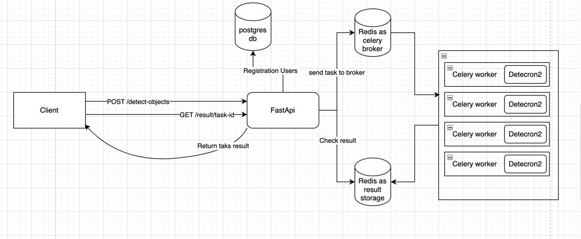
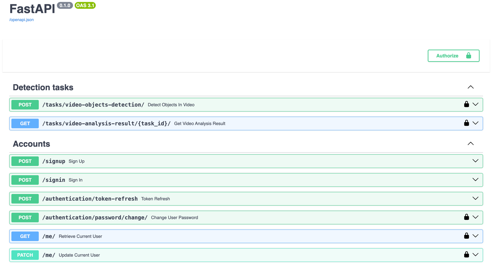

# Video Analysis API with FastAPI and Detectron2

## Overview
This project is a FastAPI application that allows users to upload small video files for analysis. It leverages Tortoise-ORM for database interactions and integrates a background task processing system using Celery to handle video analysis. The core functionality involves analyzing video files frame by frame using the Detectron2 machine learning model to detect objects within the images.

## Architecture design schema


## Features
- **Video File Upload:** Users can upload small-sized video files for analysis.
- **Background Video Analysis:** Uploaded videos are processed in a background task using Celery, with the Detectron2 model providing frame-by-frame object detection.
- **Flexible Model Integration:** The architecture supports easy integration of additional models. Developers can implement a new model class using the provided interface and create a factory for its construction.
- **User Authentication:** The application includes a basic user class with JWT token authentication.
- **Task Ownership Verification:** There is a built-in mechanism to ensure that only the owner of a task can query its results.

## Interactive API Documentation
After running the application, you can access the interactive Swagger UI documentation at `127.0.0.1/docs/`. This interface allows you to try out the API functionality directly from your browser.


## API Endpoints

### Detection Tasks
- `POST /tasks/video-objects-detection/` - Endpoint to submit a new video for object detection. The video file should be included in the request.
- `GET /tasks/video-analysis-result/{task_id}/` - Retrieve the result of the video analysis for a specific task using the unique `task_id`. Only taks owner have permission to get result.

### Accounts
- `POST /signup` - Register a new user account.
- `POST /signin` - Authenticate a user and obtain a JWT token.
- `POST /authentication/token-refresh` - Refresh the JWT token for authenticated users.
- `POST /authentication/password/change/` - Change the password for the current authenticated user.
- `GET /me/` - Retrieve information about the current authenticated user.
- `PATCH /me/` - Update user information for the current authenticated user.


## Getting Started

### Prerequisites


### Installation
1. Clone the repository:
    ```bash
    git clone https://github.com/yourusername/yourprojectname.git
    ```

### Running the Application
To get started, ensure you have Docker installed on your system. Then, you can launch the application using the following command:
```bash
docker-compose -f docker-compose-develop.yml up
```

## Extending the Application
To integrate a new model, implement a class following the class "AbstractImageAnalysisMLModel" interface and update the model factory to construct instances of your new model.

## Security
JWT authentication is used to secure the API. Ensure your JWT tokens are kept safe and not exposed in public repositories or client-side code.
